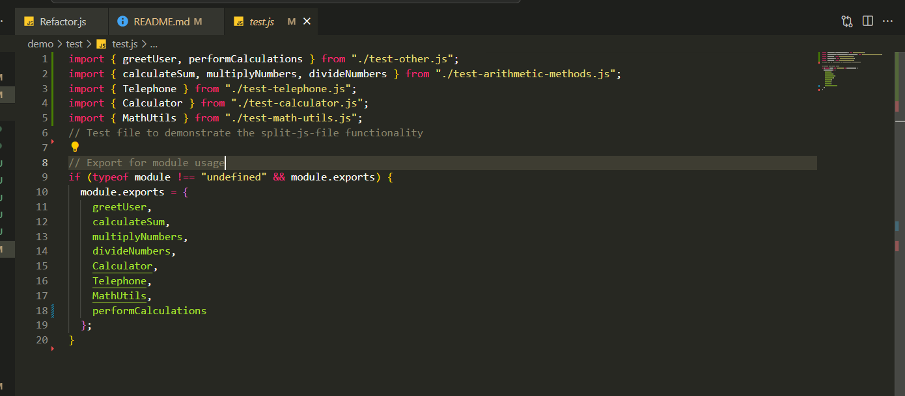
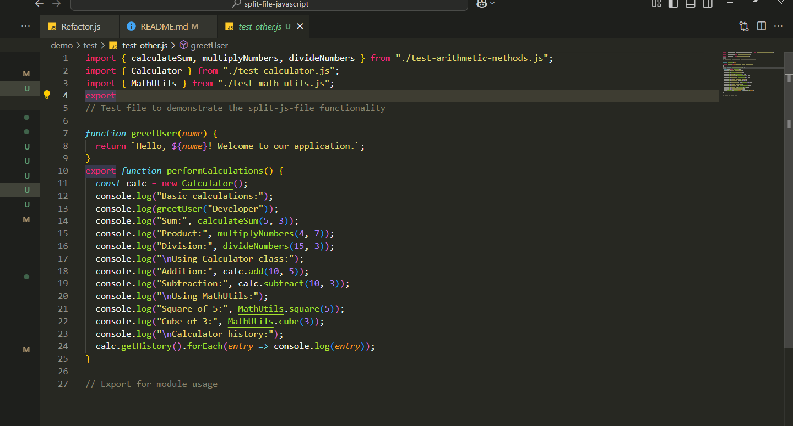

## Tool tách nhỏ file js

## Demo việc tách file theo cấu hình

file test.js sau khi tách



file mới sinh ra tự động import từ các file cần thiết



## Hướng dẫn sử dụng

## file source refactor code

[Refactor.js](Refactor.js)

trong file Refactor.js có 2 hàm quan trọng là analyzeFiles() dùng để thống kê xem file nguồn có những method, class, variable nào, số dòng của từng method, class

hàm splitFiles() được dùng để chia nhỏ file theo config của người dùng truyền vào, có thể là 1 biến hoặc gọi từ file json

## file demo việc tách file theo config có sẵn

[demo](./demo/test-split-js.js)

## cấu trúc của kết quả sau khi phân tích analyzeFiles như bên dưới, copy vào cho AI gen từ mẫu prompt sau

[PROMPT](PROMPT.md)

```
[
  {
    "filePath": "D:\\code\\my code\\split-file-javascript\\demo\\test.js",
    "functionDeclarations": [
      { "name": "greetUser", "totalLine": 3 },
      { "name": "calculateSum", "totalLine": 3 },
    ],
    "classDeclarations": [
      {
        "name": "Telephone",
        "totalLine": 21,
        "methods": [
          { "name": "add", "totalLine": 5 },
          { "name": "subtract", "totalLine": 5 },
          { "name": "getnumber", "totalLine": 3 }
        ]
      },
    ],
    "totalFunctions": 6,
    "totalClasses": 3
  }
]

```

## cấu trúc chung của file config json để chạy tool

```

[
  {
    "filePath": "D:/code/my code/split-file-javascript/demo/test.js",
    "items": [
      {
        "class": "Calculator",
        "methods": [
          { "name": "add", "newName": "addNumbers" },
          { "name": "subtract", "newName": "subtractNumbers" }
        ]
      },
      { "name": "MathUtils", "newName": "ExtendedMath" },
      { "name": "greetUser", "newName": "sayHello" },
      "performCalculations"
    ],
    "splitedSubName": "test_method_one.js"
  },
  {
    "filePath": "D:/code/my code/split-file-javascript/demo/test.js",
    "items": ["calculateSum", "multiplyNumbers", "divideNumbers"],
    "splitedSubName": "test_method_two.js"
  },
  {
    "filePath": "D:/code/my code/split-file-javascript/demo/test.js",
    "items": [{ "name": "Telephone", "newName": "Phone" }],
    "splitedSubName": "test_method_three.js"
  }
]


```

Trong đó:

"filePath" : full path tới file source

"items" : danh sách các method, class, variable của file gốc sẽ được mang sang file mới

trong items sẽ là mảng các tên bằng string, nếu nhiều hàm trùng tên nằm trong 1 file thì tên sẽ được viết dạng object với "name" là tên gốc, "newName" là tên mới sau khi export import

trường hợp muốn tách method trong class thì phải khai báo rõ object gồm "class" là tên class và "methods" là mảng các method cần tách

"splitedSubName" : sub tên của file đã tách => khi tách xong sẽ nằm cùng cấp với file gốc
